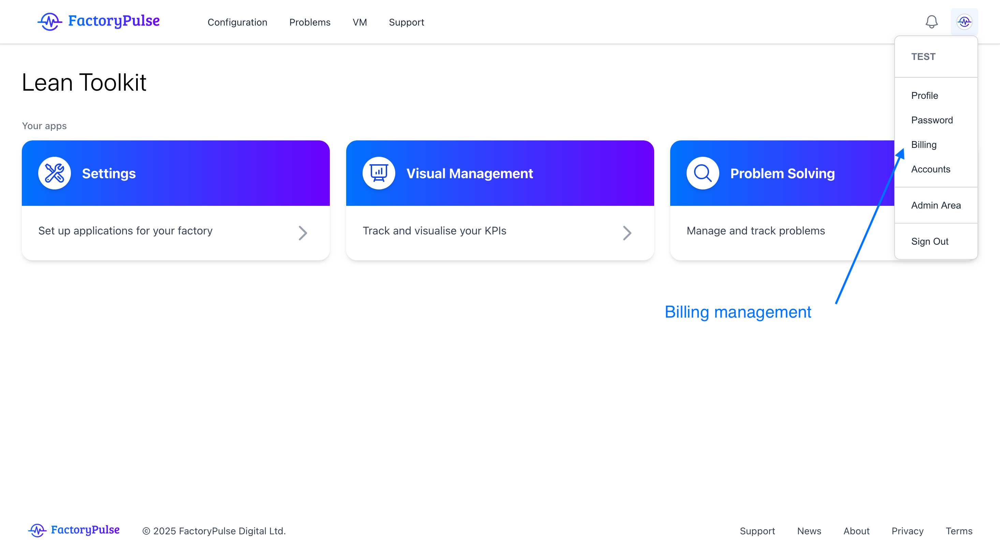
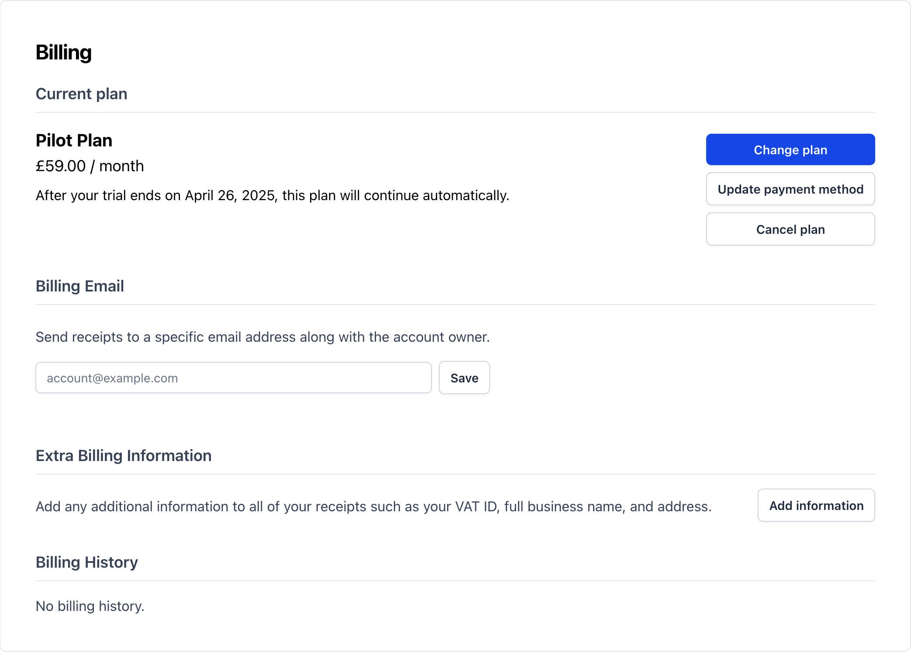
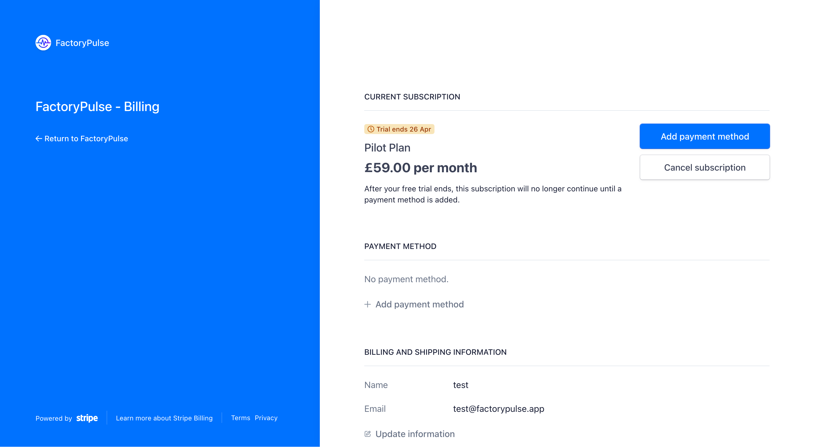

At FactoryPulse, we believe in simplicity and transparency. We do not believe in hidden fees or surprise charges. We are a subscription based service and we will never charge you for usage outside of the subscription.

From the billing page, you can manage your billing information, change your plan, or cancel your subscription.

<Warning>
  Only account admins can manage the billing information for the account.
</Warning>
1. Click on your avatar in the top right corner of the screen.
   

2. Click on billing and you will see the current plan and the next billing date.
   

3. If you want to make changes to your plan we will redirect you to the Stripe billing portal to manage your billing information. We use Stripe to process all payments and we do not store any billing information on our servers.
   
