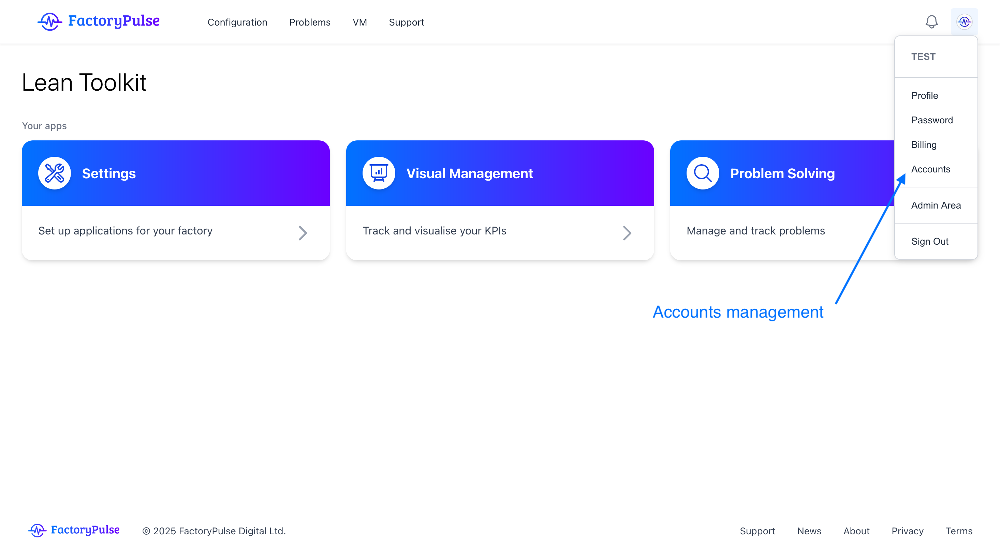
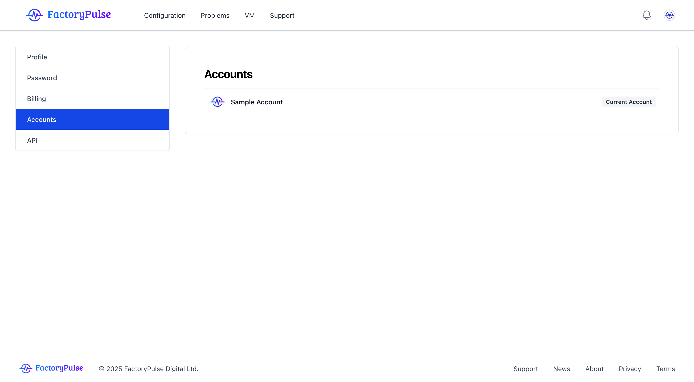
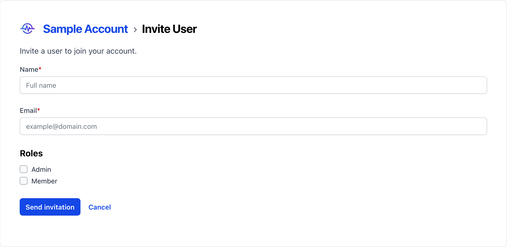

Accounts are the top level of organization in FactoryPulse. They are used to organize your data and users. All users in an account are able to access the same data and projects. Users outside of the account will not be able to access the account or its data.
To invite a user to your account, follow these steps:
<Warning>
  Only account admins can invite users to their account.
</Warning>
1. Click on your avatar in the top right corner of the screen.
   

2. Click on your account name and then click on the **Invite User** button.
   

3. Enter the name and email address of the user you want to invite.
   
4. The user will receive an email with a link to complete the signup process.
