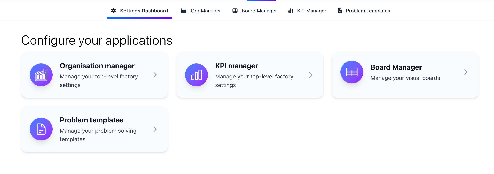

In FactoryPulse Org Levels are used to create a hierachy for your data. This allows you to create different views of your data based on the org level.
We know that different stakeholders will often want different views of the data, we've created a flexible system that allows you to create the right view for your needs.
As a default FactoryPulse has 3 different levels of organizations: the Factory, the Department, and the Cell. If this fits your needs you can use the default levels or you can create your own.

- **Factory**: The top level of organization where data is aggregated, normally this is a single physical factory. Data would not normally be inputted at the factory level, but it would be used for reporting and analytics.
- **Department**: The second level of organization, this would be a logical grouping of cells. For example, in a manufacturing facility you may have different departments for production, engineering, and quality.
- **Cell**: The third level of organization, this would be the most granular level of organization. For example, in a manufacturing facility you may have different cells within production, or multiple teams within engineering.

<Note>
You can only have 1 item at each level, this is to ensure data can flow through the heirachy's correctly. For example, if you have 2 factories, you would need to create a new org level for one of the factories.
</Note>

## Managing Org Levels

<Warning>
  Only account admins can manage the billing information for the account.
</Warning>

To manage your org levels, follow these steps:

1. Open the organisation manager insider the configuration menu.
   

2. On the org manager you will see your organisations on the left hand side, and the org levels on the right hand side.
   

 ### Editing Org Levels
To edit an org level, click on the org level you want to edit. Here you can change the name and the name and the level of the org.
   
