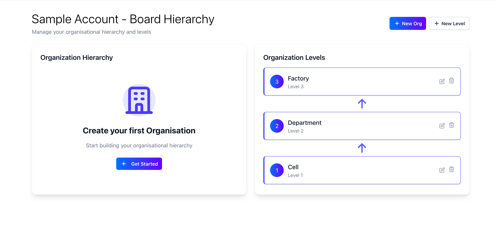

<Warning>
  Only account admins can manage the org setup for the account.
</Warning>

An Organisation inside FactoryPulse is our way of grouping data together for a team, this can be at a factory, a department, a cell or whatever fits your needs. For most users this will align to either your physical factory layout or organisational structure.

To manage the org setup for the account, follow these steps:

1. Open the organisation manager insider the configuration menu.
   

2. On the org manager you will see your organisations on the left hand side, and the org levels on the right hand side. For guidance on org levels please see the [org levels](/accounts/org-levels) page.

3. To create a new organisation, click on the "Get started" button. This will open a form where you can enter the name of the organisation.

4. Enter the name of the organisation and select the right org level. To enable data to flow through the visual boards you need to select a parent org. You'll also see an option to enable our AI summary feature. This will send a daily summary of the data on the visual board to the email addresses specified.

<Tip>
  We recommend starting with the factory as the parent org and working your way down the levels. If you're just starting out and want to see how data flows, we recommend having 2 levels of orgs with 1 parent org and 2 child orgs.
</Tip>
<Note>
  AI summaries will only begin to work once you have data on the visual board.
</Note>

5. Click on the "Create" button to create the organisation.

6. Once you start creating your orgs you'll see them on the left hand side of the org manager with the hierarchy of the orgs visible
