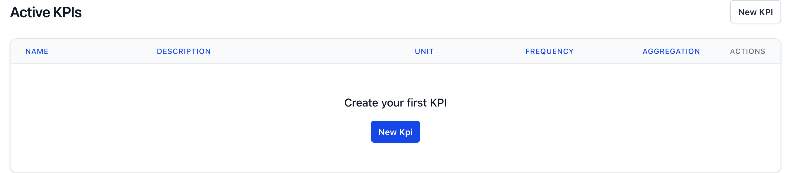
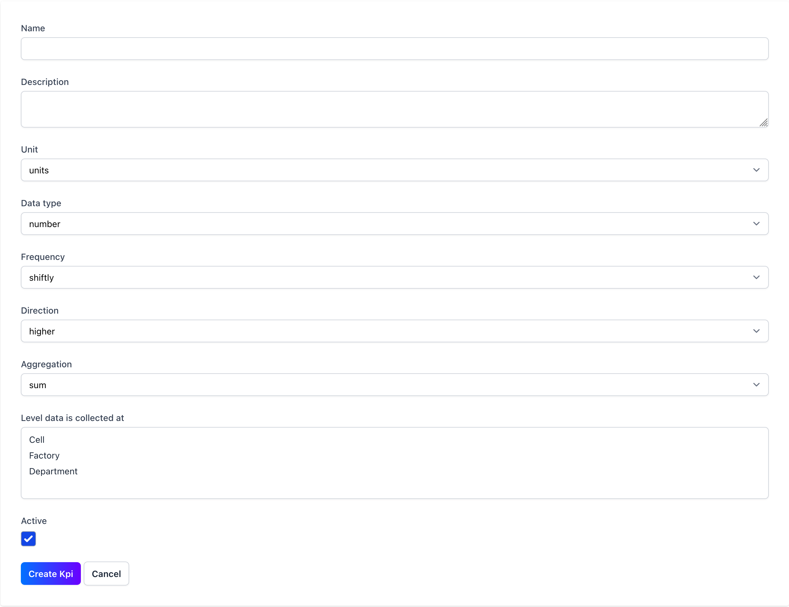

<Warning>
  Only account admins can manage the KPI's for the account.
</Warning>

KPI's are the building blocks of your VM board. They are the metrics that you want to track and visualise.

<Steps>
  <Step title="Launch the KPI manager">
    Launch the KPI manager by clicking on the KPI manager icon in the configuration menu.
    

    
  </Step>
  <Step title="Create a KPI">
    Create a KPI to start tracking your data. Ensure you've set the direction of the KPI to either "up" or "down" to indicate if a higher or lower value is better. The frequency the data should be inputted and at what level the data should be inputted. For example, you might collect output shiftly at a cell level, first time pass rate daily at a department level or absence monthly at a factory level.
    
  </Step>
  <Step title="Edit a KPI">
    Once created you can edit the KPI by clicking on the edit icon <Icon icon="pencil" iconType="solid" /> in the KPI manager.
    <Info>
      You can't completely delete a KPI, clicking the delete icon <Icon icon="trash" iconType="solid" /> will archive the KPI. Archived KPIs are hidden end users but are visible at the bottom of the KPI manager.
    </Info>
  </Step>
</Steps>
