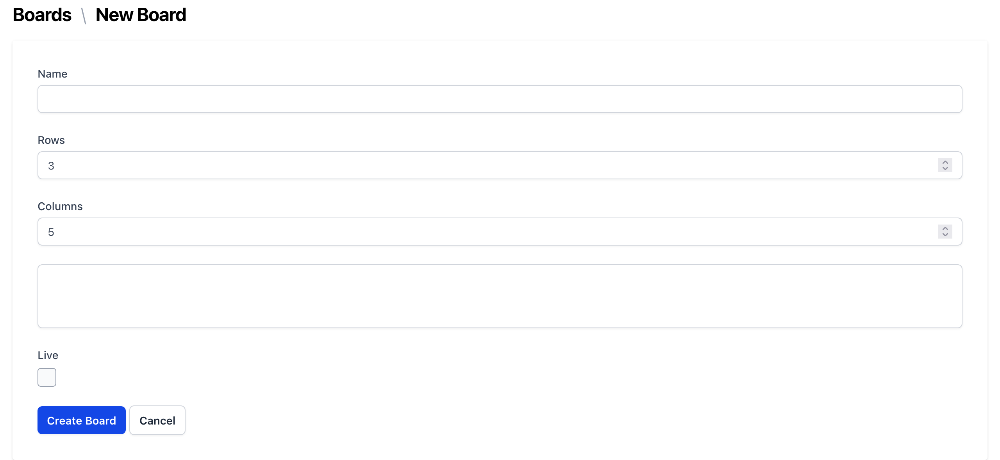
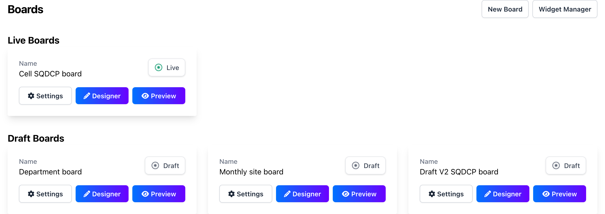
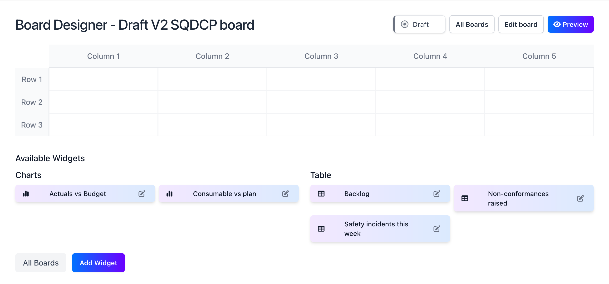
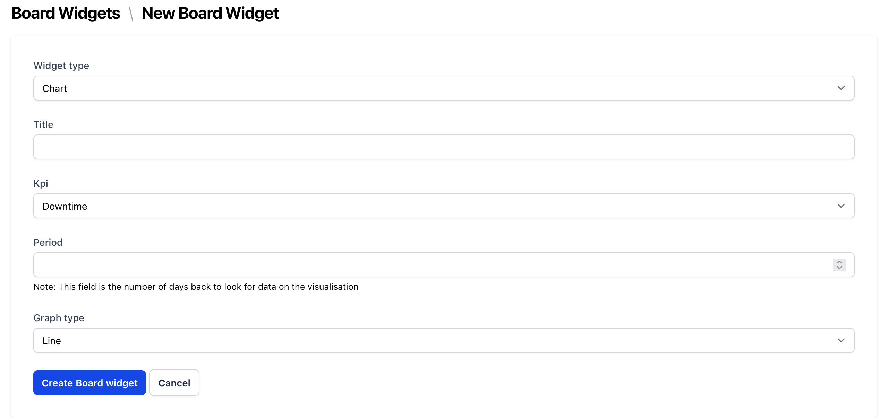

<Warning>
  Only account admins can manage the board templates for the account.
</Warning>

<Steps>
  <Step title="Launch the Board manager">
    Launch the Board manager by clicking on the Board manager icon in the configuration menu.
    
  </Step>

  <Step title="Create a new board template">
   <Check>
    Ensure you have setup your Org structure before creating a board template.
  </Check>
    Create a new board template by clicking on the "New Board" button.
    
    Give your board template a name, set the number of columns and the number of rows. Select the orgs you want this board to apply to and tick to make it live.
  </Step>
  <Step title="Manage your board template">
   - Once you've created a board template, you can change the name, size and orgs the board applies to using the settings button.
   - You can preview the board template by clicking on the "Preview" button.
   - You can edit the board template by clicking on the "Designer" button.

    
  </Step>
  <Step title="Board Designer">
    The board designer is where you can add elements to the board.
    
  </Step>
<Step title="Create a Widget">
  Widgets are the individual elements that make up the board. Click on the Add Widget button to add a new widget. You can make titles, tables and charts.
  
  <Info>
    If you select chart or table, you need to define the period of the data you want to display on your board. This will take account of the frequency you defined for the KPI, for example if the KPI is weekly and you do 4 periods, the chart will display the last 4 weeks of data.
  </Info>
  </Step>
  <Step title="Drag and drop your widgets">
    Once you've created your widgets, you can drag and drop them onto the board and reorder them as you like.
    
  </Step>
</Steps>
